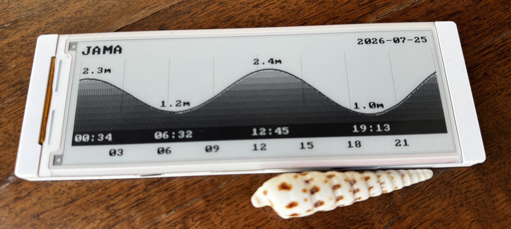
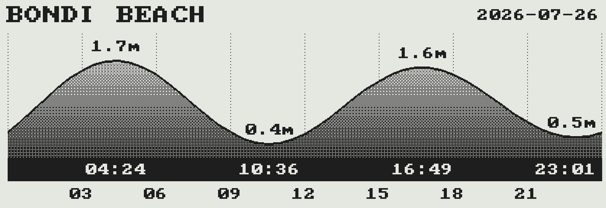
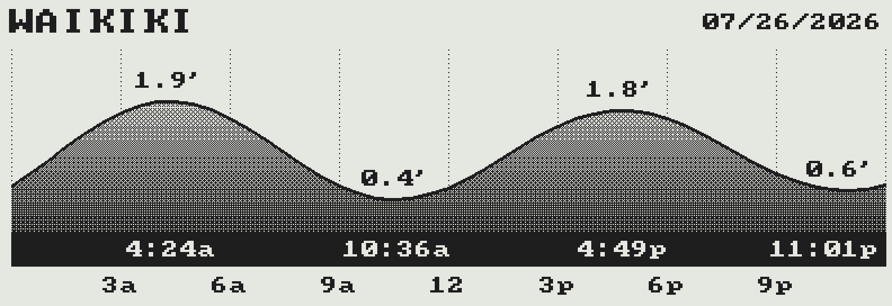

A daily tide chart on an [Elecrow CrowPanel 5.79" E-Paper HMI](https://www.elecrow.com/crowpanel-esp32-5-79-e-paper-hmi-display-with-272-792-resolution-black-white-color-driven-by-spi-interface.html)
(ESP32-S3, 792x272 dual-SSD1683 panel), built on plain ESP-IDF.

Once a day, just after midnight in the tide station's timezone, the device
wakes from deep sleep and draws the new day's 24-hour chart (curve,
high/low times and heights, gridlines), then goes back to sleep — the
e-paper keeps the image with essentially no power. Tide predictions are
deterministic, so a month of heights and extremes from the
[WorldTides API](https://www.worldtides.info/apidocs) is cached in flash
(surviving power loss) and the radio only comes up when the cached window
runs low, roughly every three weeks. A failed refresh leaves the previous
chart on screen and retries half an hour later.

The onboard controls navigate the cache without any network:

| Control | Action |
| ------- | ------ |
| Wheel   | Browse forward/backward a day at a time |
| EXIT    | Return to today |
| MENU    | Force a full refetch |

## Setup

1. Install [ESP-IDF](https://docs.espressif.com/projects/esp-idf/) v5.5.x
   and activate it (`. <idf-path>/export.sh`).
2. Get a WorldTides API key and pick your station's coordinates from
   [worldtides.com/tidestations](https://www.worldtides.com/tidestations).
3. Configure:

   ```sh
   cp main/config.example.h main/config.h
   # edit main/config.h: WiFi, timezone, API key, station
   ```

4. Build and flash:

   ```sh
   idf.py set-target esp32s3
   idf.py -p <port> flash monitor
   ```

## Rendering on the host

The chart renderer compiles unchanged on a regular computer:
[tools/render](tools/render) links the real `chart.c` against stubbed
framebuffer primitives and dumps a pixel-exact PBM of what the panel
would show, using synthetic tides. Handy for previewing display changes
without flashing:



The same render with a 12-hour clock, heights in feet, and m/d/y dates
(`TIDE_TIME_FMT`, `TIDE_UNITS`, `TIDE_DATE_FMT` in `config.h`):



## Notes

- Tide heights are requested relative to Chart Datum (`datum=CD`), the
  convention used on tide tables. The API bills 1 credit per 7 days each
  for heights and extremes, so the monthly cache costs ~8 credits per
  refetch (~12/month).
- The vertical scale fits each day's range; the horizontal scale is fixed,
  midnight to midnight in the station's timezone.
- The display driver lives in
  [components/crowpanel579](components/crowpanel579) and is reusable for
  other apps on this board. The dual-controller panel has several sharp
  edges (RAM bank swapping after every update, waveforms that can only
  clear or only draw, a seam byte shared by both controllers) — read
  [components/crowpanel579/HARDWARE.md](components/crowpanel579/HARDWARE.md)
  before touching it.
